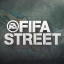
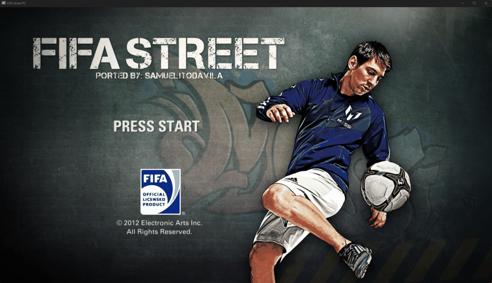
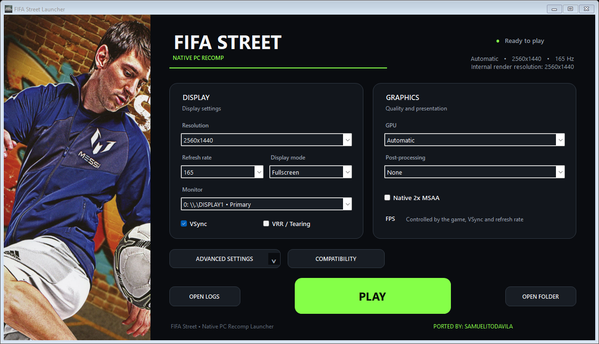
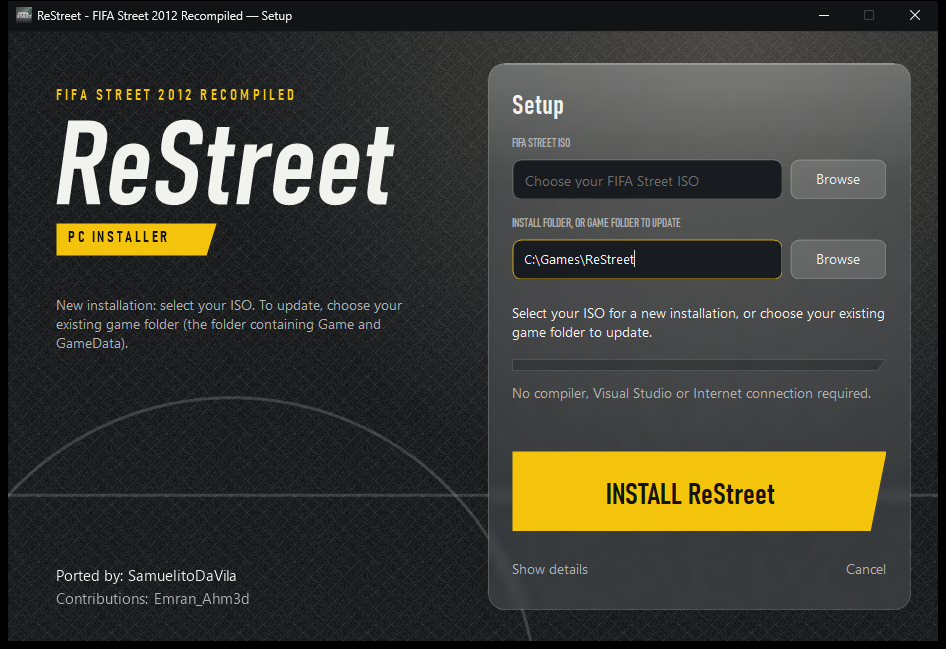

# ReStreet - FIFA Street 2012 Recompiled

**FIFA Street (2012) on Windows PC, built with ReXGlue. Bring your own game.**

### Ported by: SamuelitoDaVila

[Download](https://github.com/samuelit0davila/fifa-street-pc-port/releases/latest) · [Changelog](CHANGELOG.md) · [Report a bug](https://github.com/samuelit0davila/fifa-street-pc-port/issues) · [Build from source](docs/BUILDING.md)

## What is this

ReStreet is a Windows PC version of FIFA Street (2012) made by recompiling the Xbox 360 game with [ReXGlue](https://github.com/rexglue/rexglue-sdk). It comes with a graphical installer and a launcher with Direct3D 12 and Vulkan support, display and resolution settings, and performance profiles.

You need your own copy of the game: an Xbox 360 ISO of FIFA Street (2012). The ISO and the game files are not included.

**v1.1 is offline only.** It has no online play.

## What's new in v1.1

- **ReStreet main menu logo**, applied from the new `Mods` folder without changing your game files.
- **Improved "Some" graphics readback**, now the default: less graphical garbage on floors and reflections, with the same speed.
- **VSync works smoothly.** It keeps the game locked to your refresh rate with no tearing.
- **Direct play:** start the game without the launcher window using `FifaStreetLauncher.exe --play`, or create a desktop shortcut with the new **Shortcut** button.
- **Launcher and setup fit any screen**, at any resolution and Windows scale.
- Your saves and settings are kept when you update. See the full [changelog](CHANGELOG.md).

## What's new in v1.0

- **Performance profiles** in the launcher: Balanced (default), Quality for strong PCs, and Performance for weaker PCs.
- **Shader cache included**, so the first matches have fewer slow moments.
- **FPS counter:** press **Home** to show or hide it.
- **Exit shortcut:** hold **START** and press **B** (Xbox layout) or **START** and **Circle** (PlayStation layout) to open the exit prompt. A confirms, B cancels.
- **New launcher and installer design.** Both follow the Windows display scale and shrink to fit small screens.
- Same game files as v0.4.1, so your saves and settings keep working. See the full [changelog](CHANGELOG.md).

## Download and install

1. Download **FifaStreetSetup.exe** from the [latest release](https://github.com/samuelit0davila/fifa-street-pc-port/releases/latest) and check its SHA-256 against the value on the release page.
2. Run it, choose your FIFA Street ISO and an empty folder, then press **INSTALL ReStreet**.
3. When it finishes, press **OPEN LAUNCHER**, pick your settings and press **PLAY**.

To update from an earlier version, select the folder that contains `Game` and `GameData`. No ISO is needed, and your saves and settings are kept. Only game versions that match the three verified original module hashes are accepted.

No compiler, Visual Studio or Internet connection is needed.

## System requirements

These are estimates from my own testing, not guarantees. If you try it on an older PC, tell me your specs and FPS.

| | |
|---|---|
| System | Windows 10 or 11, 64-bit |
| CPU | x86-64 with SSSE3; a quad-core is safest |
| GPU | Direct3D 12 or Vulkan with up-to-date drivers (about GTX 900 / RX 400 or newer) |
| RAM | 8 GB |
| Disk | 12 GB free to install, 2 GB to update |
| Game | Your own FIFA Street (2012) Xbox 360 ISO |

On a weaker PC, choose the **Performance** profile in the launcher.

## Graphics backends

The launcher packages two validated ReXGlue graphics backends: **Direct3D 12** (the default, with GPU selection) and **Vulkan** (automatic device selection). It switches the matching runtime files by itself when you change the graphics API.

Full readback is the validated mode for both. The Compatibility panel offers Some, Fast and None for more FPS, but those modes are not validated and can cause graphical corruption.

## Resolution

Output resolution and internal rendering resolution are separate settings.

- **Output resolution:** the window or screen size, for example 1280x720 up to 3840x2160.
- **Internal resolution:** a whole-number scale of the game's 1280x720 base: 1x is 1280x720, 2x is 2560x1440, 3x is 3840x2160 and 4x is 5120x2880.

High settings are there for testing and do not promise 60 FPS.

## Status

This is the first stable release, but it is still a community port: performance depends on your hardware, drivers and settings. World Tour, Practice, Direct3D 12 and Vulkan were tested on earlier releases; this release changes the launcher, installer, overlays and the performance options.

See [known issues and validation](docs/STATUS.md). If you find a problem, [open an issue](https://github.com/samuelit0davila/fifa-street-pc-port/issues) with your hardware, Windows and driver versions, the graphics API and settings, and the logs from **Open logs** in the launcher. Please do not upload ISOs or game files.

## Credits and licence

I developed this project with assistance from **ChatGPT, OpenAI Codex and Anthropic's Claude (Claude Code)**, and directed and tested the work myself.

Thanks to **Emran_Ahm3d** for investigating and suggesting the Windows patch line-ending fix, module-registration path handling, flexible game-data paths, the FootballCompEng function-boundary override and resource-compiler compatibility.

Thanks to [ReXGlue](https://github.com/rexglue/rexglue-sdk), [Xenia](https://github.com/xenia-project/xenia), [extract-xiso](https://github.com/XboxDev/extract-xiso), LLVM, CMake, Ninja, .NET and MonoGame. See the [third-party notices](licenses/README.md).

My original installer, launcher and scripts use the [MIT License](LICENSE). Third-party components keep their own licences. The installer includes generated game binaries; the MIT licence does not establish the right to redistribute them, and no legal clearance is claimed. FIFA Street, its game content, artwork and trademarks belong to their respective owners.

This is an unofficial community project, with no affiliation to EA, Microsoft or Xbox.
