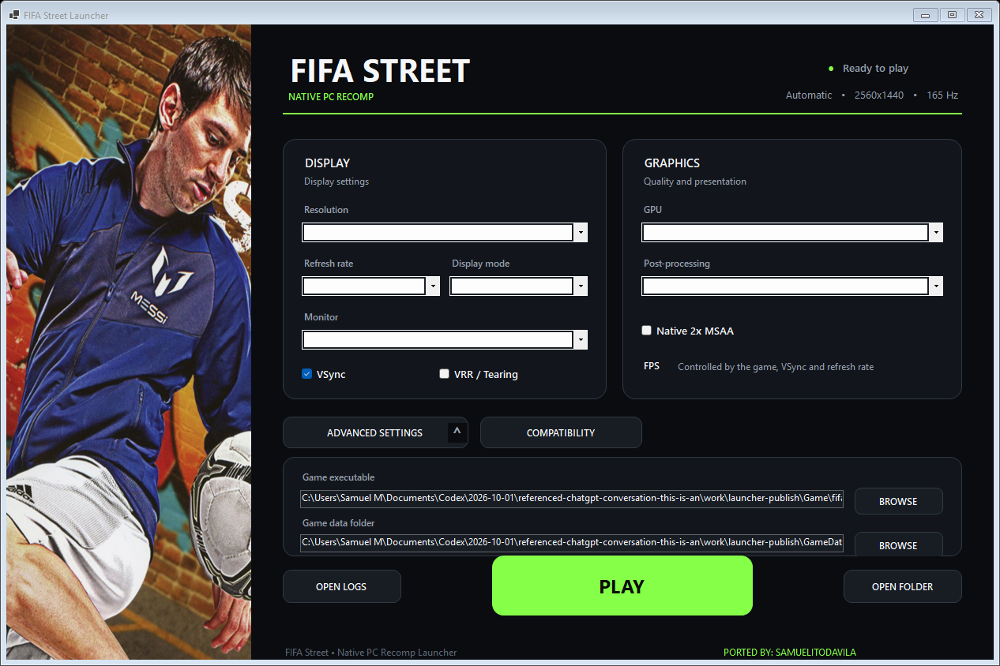
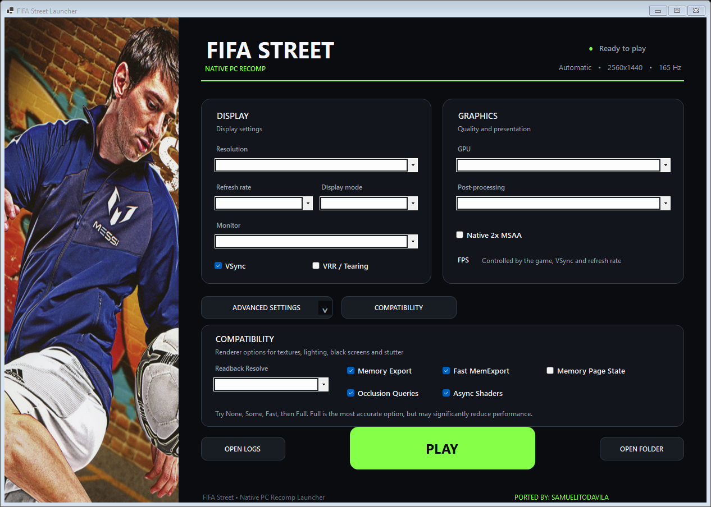
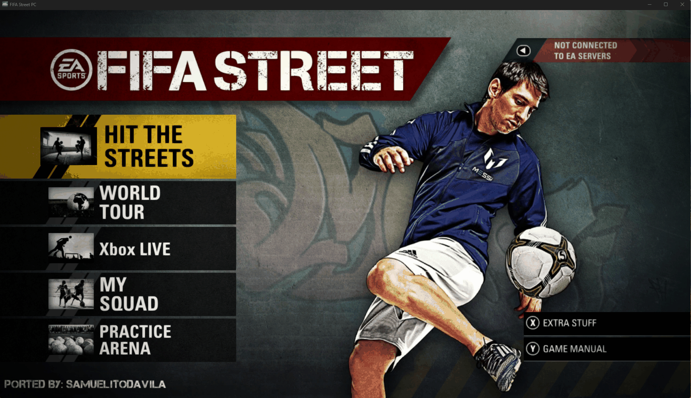

<div align="center">


# FIFA Street Recompiled

**FIFA Street (2012), recompiled for Windows PC with ReXGlue.**

### PORTED BY: SAMUELITODAVILA

**Developed with AI assistance. Directed and tested by SAMUELITODAVILA.**


[Download & installation](#download--installation) · [Screenshots](#screenshots) · [Features](#features) · [Project status](#project-status) · [Troubleshooting](#troubleshooting) · [AI assistance](#ai-assisted-development) · [Credits](#credits)


</div>

---

## About the project

FIFA Street Recompiled is a community project working toward a native Windows PC version of **FIFA Street (2012)** from the Xbox 360 release.

The installer takes your own ISO, extracts the game data, applies the start-screen and main-menu credit changes locally, and uses ReXGlue to translate the game's PowerPC executables into C++ and compile them locally. The resulting Windows executable runs with the ReXGlue runtime, which supplies the Xbox 360 services needed by the game.

The aim is a straightforward experience: **one installer, your ISO, your installation folder, and a dedicated PC launcher.** The launcher provides display, graphics and compatibility settings in one place.

> **Bring your own game.** This repository and its installer do not include an ISO, extracted game archives, original XEX executables, or recompiler-generated game code. Those files are produced locally from the user's copy. Branding images are included for project presentation and remain the property of their rights holders.

> **Experimental build.** A user-run installation with the single-file graphical installer completed successfully and produced both required game binaries. Real PC captures now show the start screen, main menu and an indoor gameplay scene. The latest installer still needs a complete user-run ISO installation test. A successful installation does not establish that every game mode, graphics option or hardware configuration works.

## Screenshots

### Installer

The English installer lets you select an ISO, choose a destination, follow progress, view details and cancel the operation. After a successful installation, it offers **Create desktop shortcut** and **OPEN LAUNCHER**.

<p align="center">
  
</p>

### PC launcher

Display and graphics settings are grouped into dedicated panels. Advanced settings expose the executable and data paths; compatibility settings expose additional renderer options.

<p align="center">
  
</p>

<details>
<summary><strong>View advanced and compatibility panels</strong></summary>

These panel captures come from an earlier UI revision; the current build retains these controls.

#### Advanced settings



#### Compatibility settings



</details>

### Start screen and main menu

The developer supplied these real captures from the working PC build. The start screen appears above; the main menu carries the credit at the bottom left. Both original captures are included unchanged.



### Gameplay

Barcelona versus Real Madrid on an indoor court, captured from the running PC port.


The overlay shows **78.3 recent FPS in this capture**. This is a single observation, not a sustained benchmark or guaranteed frame rate. Scene, hardware, settings, render scale and shader-cache state affect performance.

## Features

| Component | What it provides |
|---|---|
| Single Windows installer | A self-contained `.exe` with the installer, launcher, extraction tool, public SDK and compiler tools |
| ISO selection | Extracts and validates the required files from the user's ISO |
| Local recompilation | Builds `fifastreet.exe` and `fifastreet_fifadllzf_xex.dll` on the user's PC |
| Installation folder selection | Installs game data and locally generated binaries in the chosen location |
| Progress and diagnostics | Displays installation output and writes logs for troubleshooting |
| Cancellation | Stops the installation's active extraction or build process; incomplete files may remain |
| Optional desktop shortcut | Creates a shortcut to the installed launcher after installation succeeds |
| Display settings | Resolution, refresh rate, fullscreen/windowed mode, monitor, VSync and VRR/tearing |
| Graphics settings | GPU selection, post-processing and native 2× MSAA options |
| Compatibility controls | Readback resolve, memory export, memory page state, occlusion queries and asynchronous shaders |
| English interface | Installer and launcher interface text, with the project credit and matching Messi artwork |

| Vulkan runtime | Packages the renderer from the working development build and matching runtime/import libraries |
| Internal render resolution | Applies draw scaling alongside output/window size and shows the requested internal resolution |
| In-game project credits | Applies `PORTED BY: SAMUELITODAVILA` to the start screen and main menu using the user's extracted files |
| Windowed restoration | Explicit minimize/restore state handling; normal restoration confirmed by the developer |

These are implemented controls and workflows. Their presence is not a guarantee that each setting works correctly in every part of FIFA Street.

### Output and internal resolution

The launcher now sets the internal draw scale as well as the output/window size. Its summary displays the **Internal render resolution** it requests.

The current engine supports integer scales of the game's 1280×720 base. The launcher uses one shared scale for both axes, large enough for the chosen output dimensions, up to the SDK's 8× limit.

| Selected output | Requested internal rendering |
|---|---|
| 1280×720 | 1280×720 — 1× |
| 1920×1080 | 2560×1440 — 2×, reduced for display |
| 2560×1440 | 2560×1440 — 2× |
| 3840×2160 | 3840×2160 — 3× |

Intermediate resolutions use the next supported integer scale, then resize for display. Higher render scales increase GPU work. Arbitrary fractional scaling and ultrawide behavior are not fully validated.

## Requirements

- **Windows x64.** This installer targets Windows; Linux and other platforms are not supported by this package.
- **Your own Xbox 360 FIFA Street ISO.** A complete region/build compatibility list has not yet been established.
- **At least 12 GB free on the destination drive**, plus additional space on the Windows temporary drive for extraction, tools and generated code, and destination space for the menu patch’s temporary archive. This is the installer's current minimum check, not a measured upper bound.
- A GPU and driver capable of running the included **Vulkan** backend. Minimum CPU/GPU specifications remain unverified.
- An Internet connection if Microsoft C++ build components need to be installed. Windows may request administrator approval for those components.

The packaged installer includes its .NET runtime, ReXGlue SDK, compiler, CMake, Ninja and ISO extraction tool. Source builds have separate developer prerequisites; see [Building from source](docs/BUILDING.md).

## Download & installation

The installer is intended for this repository's **Releases** page; this prepared source tree does not yet link to a live release. The intended first public release is an **experimental pre-release**.

1. Open the installer `.exe`.
2. Next to **FIFA Street ISO**, click **Browse…** and select your ISO.
3. Next to **Installation folder**, select a new or empty folder.
4. Click **INSTALL FIFA STREET**.
5. Allow extraction and local recompilation to finish. The first installation can take a long time. The menu-credit changes are applied before recompilation.
6. After success, optionally click **Create desktop shortcut**, then **OPEN LAUNCHER**.
7. Choose your settings and click **PLAY** in the launcher.

Use **Show details** to view the installation output. **Cancel** stops installation; wait for cancellation to finish before closing the window. Cancelled or failed installations may leave incomplete files in the selected folder, so choose an empty folder before starting again.

Keep your original ISO. You do not need to upload it or share it with this project.

### Measured installation time

One user-run installation completed in approximately **22 minutes and 12 seconds**, measured from the creation of `installation.log` at **14:58:59** to its successful completion output at **15:21:11** on **1 October 2026** (Europe/Lisbon).

This includes extraction, file installation and local recompilation. It measures time to the success output; final temporary-file cleanup is not separately timed. It is one observation on the development PC, not a minimum specification or a guarantee for another system. This run predates the latest renderer, credit-patch and window-restoration corrections.

### Installed files

```text
FIFA Street PC/
├── FifaStreetLauncher.exe
├── installation.log
├── Play FIFA Street.cmd
├── Game/
│   ├── fifastreet.exe
│   ├── fifastreet_fifadllzf_xex.dll
│   ├── rexruntime.dll
│   ├── rexgpu-xenos.dll
│   └── fifastreet.toml
└── GameData/
    └── Files extracted from your ISO
```

The binaries in `Game/` are created or copied during the local build. They are not a downloadable copy of FIFA Street supplied by this repository.

## Project status

| Area | Current evidence |
|---|---|
| ISO extraction | An earlier installer test extracted and validated the required files from the local test ISO |
| Recompilation | An earlier end-to-end run generated both game binaries and copied the runtime libraries |
| English graphical installer | Builds successfully; interface rendering checked |
| Launcher | Builds successfully; main, advanced and compatibility interfaces rendered for inspection |
| Cancellation | Child-process cancellation was verified in a dedicated check |
| Desktop shortcut | Implemented as an optional action after success; not yet tested through a completed latest-version installation |
| Self-contained graphical installer | A user-run installation with the packaged SDK/toolchain completed successfully; later UI revisions and clean-PC setup still need complete validation |
| Real PC screens and gameplay | Developer supplied genuine start-screen, main-menu and indoor-match captures; complete match/mode coverage remains pending |
| Menu-credit patch | Tested on copies of original archives: only two menu entries changed, both match the working build byte for byte, and the BH index matches |
| Repeat credit patch | Already-patched menu archives are recognized and skipped |
| Windowed minimize/restore | Developer confirmed normal restoration after the SDL state fix; the same runtime is included in the installer |
| Vulkan packaging | Libraries checked against the selected Vulkan build; earlier D3D12 packaging corrected |
| Latest complete ISO installation | Pending the next user-run test of the corrected installer |
| Saves, audio and controller coverage | Complete verification is still pending |

See [Known issues and validation](docs/STATUS.md) for details. The project does not currently promise perfect compatibility, a particular frame rate, working online play, or support for every FIFA Street release.

## Troubleshooting

### The installer rejects my ISO

Check that the extracted image contains `default.xex`, `fifadllzf.xex.dll`, `data0.big` and `data1.big`. The installer validates these files before recompilation. A different release may require additional work; include your region/build information in a bug report, but do not attach the ISO.

### Installation fails during recompilation

Open **Show details** and save the relevant error. Include `installation.log` from the destination folder and the build logs identified by the installer. The most useful compiler excerpt starts at `FAILED:` and ends at `ninja: build stopped`.

### Installation was cancelled

Cancellation does not turn an incomplete installation into a playable game. Some installed files and build diagnostics remain. Choose a new or empty installation folder for the next attempt.

### The game does not launch, shows a black screen or crashes

Use **OPEN LOGS** in the launcher, if available, and include the last relevant entries. State your Windows version, CPU, GPU, driver version, game region/build and launcher settings. Gameplay compatibility is still being established, so report the observed behavior rather than assuming installation success means full compatibility.

### I want to report a bug

Use this repository's **Issues** tab and the bug-report form. Attach text logs and genuine screenshots where possible. Remove personal information you do not want to publish. Do not attach game executables, extracted archives, ISOs or generated game code.

## Development

The repository contains the installer and launcher source, recompilation configuration, host-side code, build scripts and the patch recording the local ReXGlue changes.

```text
.
├── Installer/
│   ├── FifaStreetSetupTool/     Graphical installer and installation engine
│   ├── recomp-template/        Host source and recompilation configuration
│   ├── payload/Game/           Runtime configuration
│   ├── BuildFifaStreet.ps1     Local game build
│   └── BuildSetup.ps1          Installer packaging
├── Launcher/FifaStreetLauncher/
├── patches/                    Local SDK changes
├── licenses/                   Third-party notices
├── docs/                       Build guide, status and project presentation
└── .github/ISSUE_TEMPLATE/      Bug-report form
```

Recompiler-generated game source, extracted data, SDK builds and installer binaries are excluded from Git. The authored `generated/rexglue.cmake` helper is retained; it is build scaffolding, not generated guest code.

Read [Building from source](docs/BUILDING.md) and [Contributing](CONTRIBUTING.md) before making changes.

## Roadmap

- Complete installation testing of the latest single-file installer on the development PC and a clean Windows environment.
- Verify first boot, menus, a complete match, audio, controller input, saves and restart behavior.
- Expand the genuine gameplay gallery and record tested hardware, driver and ISO compatibility.
- Investigate unresolved guest functions and title-specific compatibility issues.
- Improve build reproducibility and confirm the third-party notices included with public releases.

## What was built and corrected

- Added the English Windows installer, ISO/destination selection, local tool bundle, cancellation and optional desktop shortcut.
- Added the English launcher, Messi artwork, original FIFA Street icons and display/graphics/compatibility controls.
- Corrected manifest encoding, host include paths and the generation of both game modules before CMake configuration.
- Improved native build-error capture, logging and build-workspace reuse.
- Corrected packaging to use the Vulkan graphics library from the working development build, with matching runtime/import libraries.
- Connected launcher selections to the internal render scale and displayed the requested internal resolution.
- Integrated a small credit-only difference recipe, local menu decoding, archive rebuilding and companion-index updates. Original game archives and the game's font are not bundled.
- Corrected SDL minimize/restore handling. An initial Vulkan-wait change did not resolve the freeze; explicitly updating presentation size/state and requesting repaint passed the developer's later test.

## AI-assisted development

**This project was developed by SAMUELITODAVILA with assistance from AI, including ChatGPT and OpenAI Codex.**

AI assisted with code and script changes, build-error analysis, debugging, installer/launcher development, local verification and documentation. SAMUELITODAVILA directed the work, made project decisions, supplied the game and screenshots, and performed installation and gameplay tests.

AI-generated suggestions were evaluated through builds, archive comparisons, logs and hands-on testing. AI assistance does not mean every feature has been verified; the test results and outstanding checks are documented explicitly. ReXGlue, Xenia and the other upstream tools remain credited to their original contributors.

## Credits

**Port, installer and launcher work: SAMUELITODAVILA**

- [ReXGlue SDK](https://github.com/rexglue/rexglue-sdk) — recompilation tooling and runtime.
- [Xenia](https://github.com/xenia-project/xenia) — foundations used by the ReXGlue runtime.
- [extract-xiso](https://github.com/XboxDev/extract-xiso) — Xbox disc-image extraction.
- [LLVM](https://llvm.org/), [CMake](https://cmake.org/) and [Ninja](https://ninja-build.org/) — compiler and build tooling.
- [.NET](https://dotnet.microsoft.com/) — Windows installer and launcher runtime.
- [MonoGame LZX decoder](https://github.com/MonoGame/MonoGame/blob/develop/MonoGame.Framework/Content/LzxDecoder.cs) — local decoding of the user’s compressed menu archives; used under Ms-PL with notices retained.
- Python and Pillow — development-time analysis and preparation of credit-texture differences; not needed by the installed game.
- ChatGPT and OpenAI Codex — AI assistance with development, debugging and documentation.
- EA and the original FIFA Street development team — the original game and associated artwork.

## License and game content

The original installer, launcher and project-authored scripts are available under the [MIT License](LICENSE).

Third-party components and derived SDK code retain their respective licenses. The included MonoGame LZX decoder uses Microsoft Public License; it is not relicensed under MIT. The SDK patch is derived from ReXGlue and is covered by its BSD 3-Clause terms; see [third-party notices](licenses/README.md).

The MIT license does not cover FIFA Street game code, game data, artwork, logos or trademarks. Those remain the property of their respective rights holders. This is an unofficial community project and is not affiliated with or endorsed by EA, Microsoft or Xbox.

Do not redistribute your ISO, extracted game data or the locally generated game binaries through this repository.
