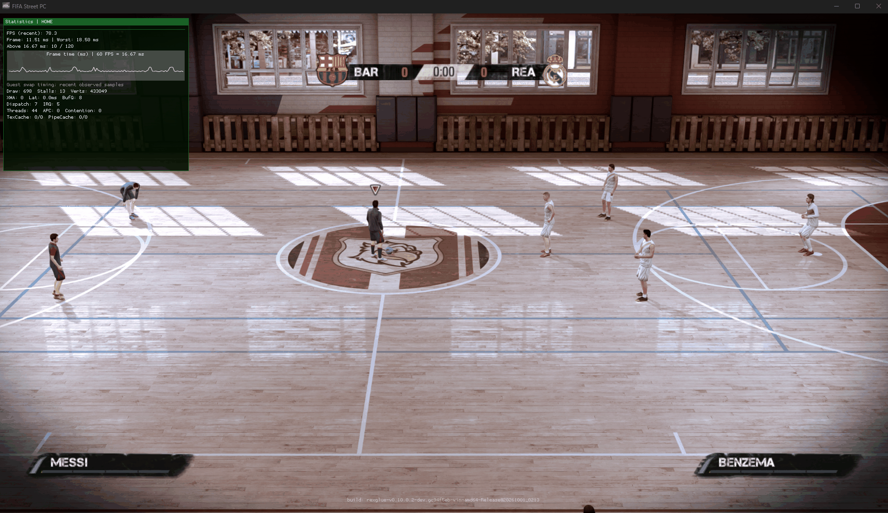



# FIFA Street Recompiled

**My experimental Windows PC port of FIFA Street (2012), built with ReXGlue.**

### PORTED BY: SAMUELITODAVILA

[Downloads](https://gitlab.com/samuelitodavila-group/fifa-street-pc/-/releases) · [Report a bug](https://gitlab.com/samuelitodavila-group/fifa-street-pc/-/issues) · [Build from source](docs/BUILDING.md)

## About

I'm bringing FIFA Street (2012) to Windows PC using ReXGlue. The project includes a graphical installer and a dedicated launcher with Direct3D 12 and Vulkan support, display settings, independent internal-resolution scaling and compatibility controls.

The installer uses your own Xbox 360 ISO to extract the game files, apply my menu credits and compile the game locally. I don't include an ISO, original game data or generated game binaries in this repository or installer.

## Download and install

The latest experimental release is available from the [release page](https://gitlab.com/samuelitodavila-group/fifa-street-pc/-/releases).

**You'll need:** Windows x64, your own Xbox 360 FIFA Street ISO, a compatible Direct3D 12 or Vulkan GPU and at least 12 GB free on the destination drive, plus extra space for temporary and build files.

1. Run **FifaStreetSetup.exe**.
2. Select your ISO and a new or empty installation folder.
3. Click **INSTALL FIFA STREET** and wait for extraction and local compilation.
4. Once complete, click **OPEN LAUNCHER**, choose your settings and press **PLAY**.

The installer includes its .NET runtime, SDK and compiler tools. Installation time varies by system.

## Graphics backends

v0.3.0 Experimental packages two validated ReXGlue graphics backends:

- **Direct3D 12** — default backend, with GPU-adapter selection in the launcher.
- **Vulkan** — uses automatic Vulkan device selection.

The launcher switches the validated `rexruntime.dll` and `rexgpu-xenos.dll` pair automatically when the graphics API is changed.

Full resolve readback is fixed to the validated configuration for both backends.

## Resolution controls

Output resolution and internal rendering resolution are configured independently.

**Output Resolution** controls the video/window output. Common modes exposed by the launcher include:

- 1280x720
- 1920x1080
- 2560x1440
- 3200x1800
- 3840x2160

**Internal Resolution** controls the integer render scale relative to FIFA Street's 1280x720 base:

- 1x — 1280x720
- 2x — 2560x1440
- 3x — 3840x2160
- 4x — 5120x2880

Higher settings are exposed for testing and do not imply a performance guarantee. Output resolution does not automatically change the internal rendering scale.

## World Tour fix

The current build recompiles the additional **FootballCompEngzf** competition-engine module used by World Tour. This fixes the crash/return-to-menu previously encountered during Bronze/Silver/Gold World Tour progression.

The installer now builds the main executable plus:

- `fifastreet_fifadllzf_xex.dll`
- `fifastreet_FootballCompEngzf_xex.dll`

A clean end-to-end installation from an original Xbox 360 ISO has been completed successfully with the current multi-backend pipeline. Direct3D 12, Vulkan, Practice and World Tour were tested successfully from that installation.

## Screenshots and gameplay

### Gameplay video

I've recorded gameplay from my PC build.

## Current status

The v0.3.0 installer pipeline has been validated from ISO extraction through credit patching, local recompilation, multi-backend packaging and first launch.

A clean installation was tested with both Direct3D 12 and Vulkan. 2560x1440 output with 2x internal rendering was specifically exercised during backend validation. World Tour was also retested successfully on the final clean multi-backend installation.

This remains an experimental port. Performance depends on hardware, drivers, output resolution and internal scale. 3x/4x internal rendering and 4K output should not be interpreted as guaranteed 60 FPS modes.

See [known issues and validation](docs/STATUS.md) for the current validation scope.

If you encounter a problem, [open an issue](https://gitlab.com/samuelitodavila-group/fifa-street-pc/-/issues) with your hardware, Windows and driver versions, selected graphics API/settings and relevant logs. Please don't upload ISOs or game files.

## Credits and licence

I developed this project with assistance from **ChatGPT and OpenAI Codex**, and directed and tested the work myself.

Thanks to [ReXGlue](https://github.com/rexglue/rexglue-sdk), [Xenia](https://github.com/xenia-project/xenia), [extract-xiso](https://github.com/XboxDev/extract-xiso), LLVM, CMake, Ninja, .NET and MonoGame. See the [third-party notices](licenses/README.md).

My original installer, launcher and scripts use the [MIT License](LICENSE). Third-party components keep their own licences. FIFA Street, its game content, artwork and trademarks belong to their respective owners.

This is my unofficial community project, with no affiliation to EA, Microsoft or Xbox.
